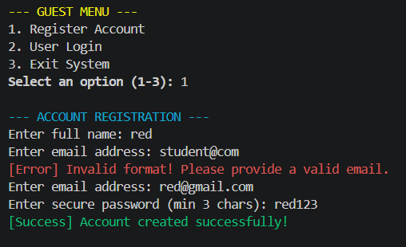
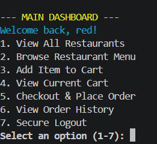
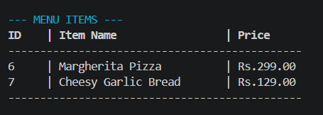
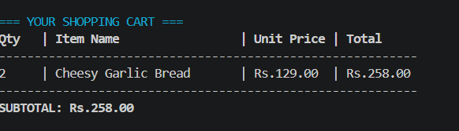
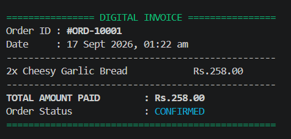

# 🍽️ Food Order Management System

> A production-grade, console-based Java application simulating a complete food ordering platform — with secure user sessions, dynamic menus, smart cart management, and digital invoicing. Built entirely with core Java, zero external dependencies.

**Course:** CSE2006 – Programming in Java | **Institution:** VIT Bhopal University | **Author:** Pratham

---

## 📖 Overview

The Food Order Management System replicates the backend logic of a modern food delivery application within a terminal interface. Instead of using a relational database, it leverages a **Singleton-patterned in-memory data layer** backed by the **Java Collections Framework** — demonstrating that robust, stateful applications can be architected purely through OOP design patterns.

The system covers the full user journey: account registration → restaurant browsing → menu selection → cart management → checkout → invoice generation → order history.

---

## ✨ Features

| Feature | Description |
|---|---|
| 🔐 **Secure Authentication** | Register & login with Regex-validated email/name inputs and Base64-encoded password storage |
| 🏪 **Restaurant Catalogue** | Browse a pre-loaded directory of restaurants with cuisine types |
| 📋 **Dynamic Menus** | View availability-filtered menus per restaurant, displayed in formatted tables |
| 🛒 **Smart Cart** | Add items; identical items are auto-grouped with quantity tracking via overridden `equals()` and `hashCode()`, powered by `Collectors.groupingBy()` |
| 💳 **Checkout & Invoice** | Calculates total, prompts `Y/N` confirmation, generates a time-stamped digital invoice |
| 📜 **Order History** | View all past orders for the logged-in user, retrieved from the in-memory ledger |
| 🛡️ **Crash-Proof Input** | Custom exceptions + recursive Scanner buffer clearing — handles any invalid input gracefully |
| 🎨 **Professional CLI** | ANSI colour codes, `printf` tabular formatting, and `LocalDateTime` timestamps |

---

## 🏗️ Architecture Overview

The project follows a **4-layer decoupled architecture**:

```
┌─────────────────────────────────┐
│     Presentation Layer          │  Main.java — All terminal I/O, menus, Regex validation
├─────────────────────────────────┤
│     Business Logic Layer        │  UserService / RestaurantService / OrderService
├─────────────────────────────────┤
│     Data Access Layer           │  InMemoryDB (Singleton) — Private fields, unmodifiable getters
├─────────────────────────────────┤
│     Model Layer                 │  User / MenuItem / Restaurant / Order / Person
└─────────────────────────────────┘
```

**Key Design Patterns & Concepts Used:**
- **Singleton Pattern** → `InMemoryDB` ensures all services share one consistent data state
- **Encapsulation** → `InMemoryDB` fields are `private`; getters return `Collections.unmodifiableList()`; writes only via `addUser()` / `addOrder()`
- **Abstraction & Inheritance** → Abstract `Person` class extended by `User`
- **Interface-Driven Design** → `ICartOperations` interface fully implemented by `OrderService`
- **Custom Exception Handling** → `UserNotFoundException`, `ItemNotAvailableException`
- **Java Streams** → `mapToDouble` for cart total; `Collectors.groupingBy()` for quantity grouping
- **Collections Framework** → `ArrayList` and `Collections.unmodifiableList()` throughout

---

## 📁 Project Structure

```
FoodOrderSystem/
│
├── src/
│   ├── Main.java                        # Entry point — UI & routing
│   │
│   ├── database/
│   │   └── InMemoryDB.java              # Singleton — private lists, unmodifiable getters, addUser()/addOrder()
│   │
│   ├── model/
│   │   ├── Person.java                  # Abstract base class
│   │   ├── User.java                    # Extends Person — uses passwordEncoded (not hash)
│   │   ├── Restaurant.java              # Restaurant entity — overrides toString()
│   │   ├── MenuItem.java                # Overrides equals()/hashCode() + toString()
│   │   └── Order.java                   # Completed order entity — overrides toString()
│   │
│   ├── service/
│   │   ├── ICartOperations.java         # Cart interface — addToCart(), showCart(), placeOrder()
│   │   ├── UserService.java             # Register, login — Base64 encoding
│   │   ├── RestaurantService.java       # Menu & restaurant queries
│   │   └── OrderService.java            # Full cart lifecycle — implements ICartOperations
│   │
│   └── exception/
│       ├── UserNotFoundException.java
│       └── ItemNotAvailableException.java
│
├── assets/                              # Terminal screenshots 
├── README.md
└── statement.md
```

---

## 💻 Requirements

- **Java Development Kit (JDK):** Version 17 or higher
- **No external libraries or database installations required**

Check your version:
```bash
java -version
```

---

## 🚀 How to Run

**Step 1 — Clone the repository:**
```bash
git clone https://github.com/your-username/FoodOrderSystem.git
cd FoodOrderSystem/src
```

**Step 2 — Compile all packages:**
```bash
javac database/*.java model/*.java exception/*.java service/*.java Main.java
```

**Step 3 — Run the application:**
```bash
java Main
```

> 💡 You can also open the project in **IntelliJ IDEA** or **VS Code with the Java Extension Pack** and run `Main.java` directly.

---

## 🧪 Testing Guide

### ✅ Positive Test Cases
| Test | Steps | Expected Result |
|---|---|---|
| Valid Registration | Enter name (letters only, 3+ chars) + valid email | Account created successfully |
| Login | Use registered credentials | Logged in, dashboard appears |
| Browse & Order | View menu → add item → checkout with `Y` | Invoice generated with correct total |
| Order History | After placing order, view history | Order appears in list with timestamp |

### ❌ Negative / Edge-Case Tests
| Test | Input | Expected Result |
|---|---|---|
| Invalid Email | `student@com` or `user` | Regex rejects — re-prompted, no crash |
| Invalid Name | `Us3r!` or `AB` | Rejected — letters and spaces only, 3+ chars |
| Text instead of number | Type `abc` at a number menu | Buffer cleared, re-prompted gracefully |
| Unavailable item | Add item ID 3 (Tandoori Roti, `available=false`) | `ItemNotAvailableException` — "Sorry! Item ID 3 is not available or does not exist." |
| Wrong login | Incorrect email/password | `UserNotFoundException` — "Invalid email or password. Please try again." |
| Abort checkout | Respond `N` at checkout prompt | Cart preserved intact, order NOT placed |
| Empty cart checkout | Select Checkout with no items in cart | "Cart is empty" notice shown, returns to dashboard |

### 🔁 Cart Quantity Test — Proves equals() + hashCode() Override
1. Browse a restaurant menu (e.g., Restaurant ID 1)
2. Add **Item ID 2 (Garlic Naan)** to cart
3. Add **Item ID 2 (Garlic Naan)** again
4. Select **View Cart**
5. You should see: `2 | Garlic Naan | Rs.40.00 | Rs.80.00`

This proves `equals()` and `hashCode()` override in `MenuItem` is working — Java treats same-ID items as identical, and `Collectors.groupingBy()` groups them with a quantity count.

---

## 🛠️ Technologies Used

| Technology | Purpose |
|---|---|
| Java (JDK 17+) | Core language |
| Java Collections Framework (`ArrayList`, `List`) | In-memory data storage |
| `Collections.unmodifiableList()` | Encapsulation of InMemoryDB collections — read-only external access |
| `java.util.regex.Pattern` | Input validation (email format, name format) |
| `java.time.LocalDateTime` | Invoice timestamp generation |
| `java.util.Base64` | Password encoding simulation (academic — not production hashing) |
| Java Streams (`mapToDouble`, `Collectors.groupingBy`) | Cart total calculation and quantity grouping |
| ANSI Escape Codes | Terminal colour & formatting |
| Git & GitHub | Version control & submission |

---

## 📸 Screenshots

| Preview | File | Description |
| --- | --- | --- |
|  | `assets/01_registration.png` | Regex rejecting `student@com`, then accepting `student@vit.edu` |
|  | `assets/02_dashboard.png` | ANSI-coloured main dashboard after login |
|  | `assets/03_menu.png` | Tabular restaurant menu (Tandoori Roti excluded — unavailable) |
|  | `assets/04_cart.png` | Same item added twice showing Quantity: 2 |
|  | `assets/05_invoice.png` | Final time-stamped digital invoice |

---

## 🔮 Future Enhancements

- **File I/O Persistence** — Serialize `InMemoryDB` to `.csv` or `.dat` files so data survives restarts (Java I/O Streams — Unit 4)
- **Multi-threading** — Simulate async delivery preparation using `Thread` / `Runnable` (Unit 3)
- **JDBC Integration** — Replace `InMemoryDB` with a real MySQL or SQLite backend (Unit 5)
- **JavaFX GUI** — Replace terminal interface with a modern windowed UI
- **Admin Module** — Add `Admin` role extending `Person` to manage restaurants and menus at runtime

---
## Author

**Pratham Yadav**  
Registration Number: **25BAI11032**  
VIT Bhopal University
